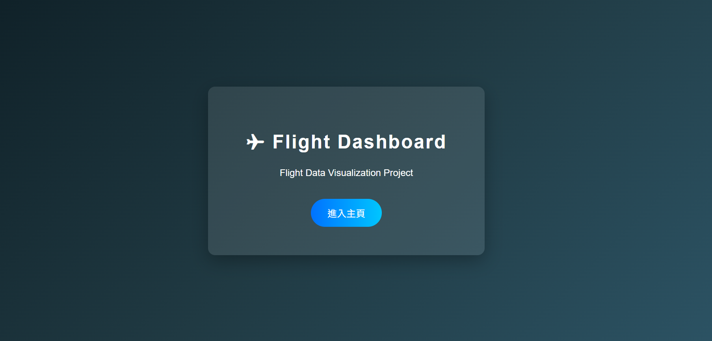
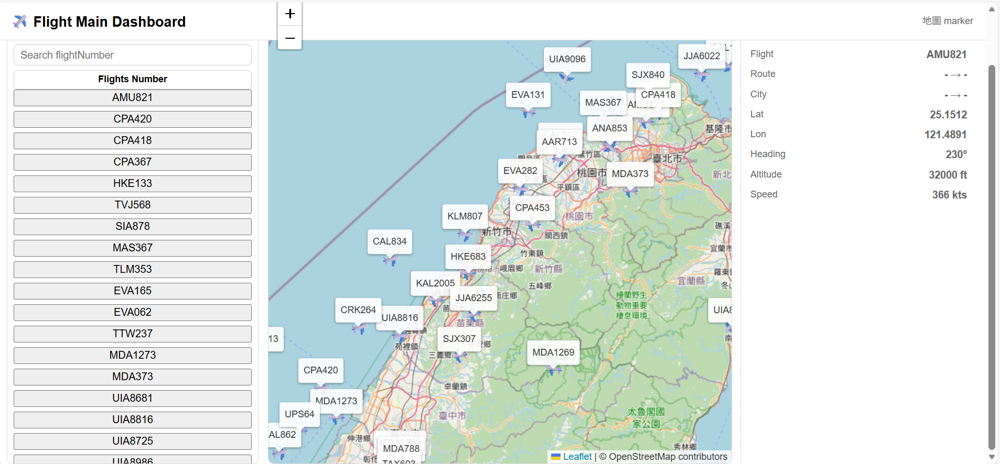

Project Flight Dashboard
Real-Time Flight Tracking System built with Spring Boot & Leaflet.js

## Dashboard View

  

## MainDash view

  

The system provides a dashboard-style interface where users can:
1.View active flights on a map/

2.Search specific flight numbers/

3.Track aircraft movement over time/

4.Display flight details dynamically/

5.Switch between mock and real flight data sources

## Used  technics:

## BACKEND
Java /
Spring Boot/
RESTful API Design/
@Scheduled Task Execution/
DTO Pattern/
Dependency Injection/
Mock Provider Pattern

## FORNTEND
HTML
CSS Grid Layout/
JavaScript /
Async/
Fetch API/
Leaflet.js/
Asynchronous data fetching/
Marker lifecycle management/
Map collections/
UI synchronization with backend state/
MVC 

## project structures
src/main/java/com.example
── controller    # REST API & Page Controllers/
── service       # Business Logic Layer/
── dto           # Data Transfer Objects/
── integration   # External API (OpenSky) Integration/
── provider      # Mock Data Provider/
── scheduler     # Scheduled Flight Updates/
── config        # Global Configuration

## Future Improvements
WebSocket real-time streaming/
Database persistence/
Cloud deployment (AWS / GCP)/
User authentication/
Historical flight replay mode

